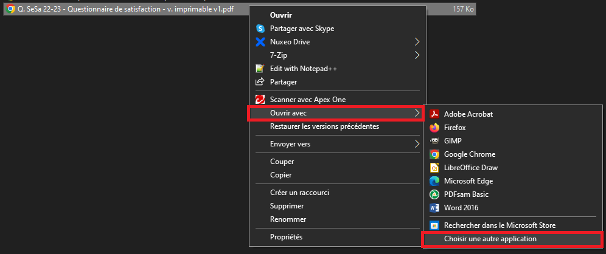
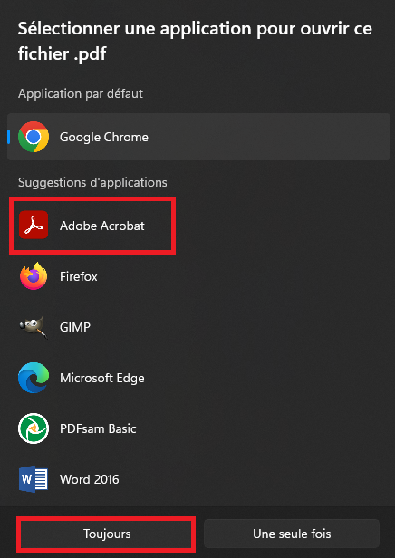
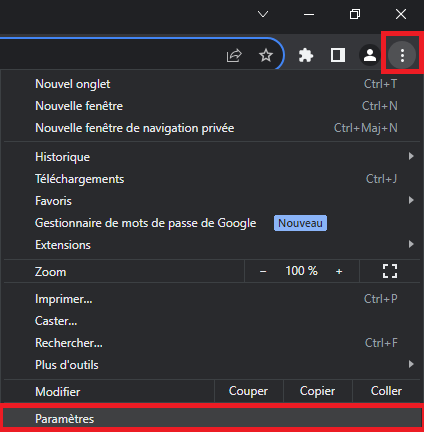
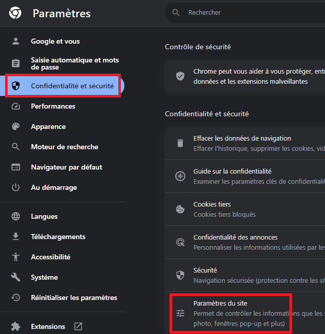
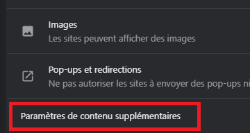
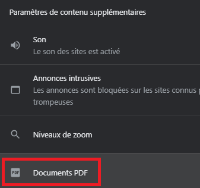
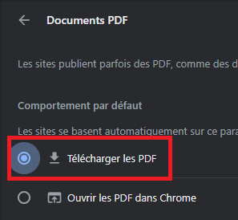

# Problème : les fichiers PDF s'ouvrent avec Google Chrome  
  
Comment résoudre le problème : les fichiers PDF s'ouvrent dans Chrome, au lieu du logiciel habituel (Adobe Acrobat Reader, etc..)

## Etape 1 : remettre le logiciel Adobe Acrobat en lecteur PDF par défaut
1.	Faire un clic-droit sur un fichier PDF quelconque.
    
2.	Dans la liste qui apparait, sélectionner « Ouvrir avec », puis « Choisir une autre application ».
        
      
3.	Sélectionner « Adobe Acrobat » (ou un autre logiciel de lecture de PDF) dans la liste, puis cliquer sur  « Toujours »;  
    {: width="400" }

Les fichiers PDF vont désormais s’ouvrir par défaut avec le logiciel sélectionné ci-dessus.
## Etape 2 : désactiver le lecteur PDF intégré à Chrome

Ceci empêchera Chrome de se remettre en application par défaut pour ouvrir les fichiers PDF, et donc de rencontrer le problème à nouveau.

1. Lancer le navigateur Chrome ;  

2. Cliquer sur les 3 petits points en haut à droite pour accéder au menu principal du logiciel, puis cliquer sur  « Paramètres »;   
    
    
3. Cliquer sur « Confidentialité et sécurité » à gauche, puis sur « Paramètres du site » au centre ;  
    
    
4. Tout en bas de la nouvelle page qui apparait, cliquer sur « Paramètres de contenu supplémentaires »;  

  
5. Dans la liste qui s’affiche, cliquer sur « Documents PDF » ;  
    
    
6. Enfin, sur la nouvelle page qui s’affiche, cliquer sur « Télécharger les PDF ».  
     

Chrome peut maintenant être fermé.  
Désormais, Chrome ne devrait plus se remettre comme lecteur PDF par défaut.
