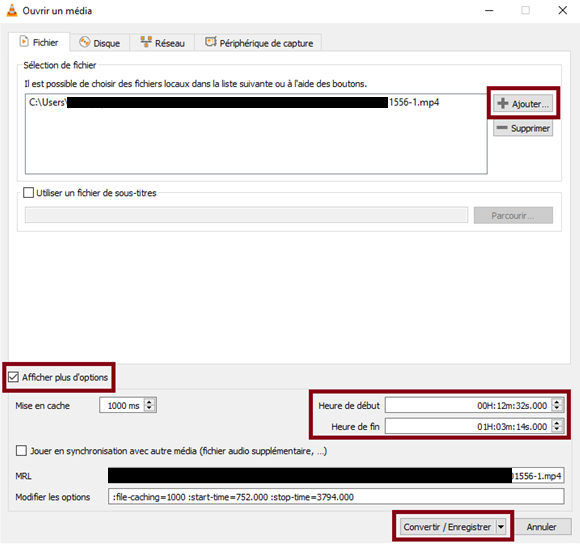
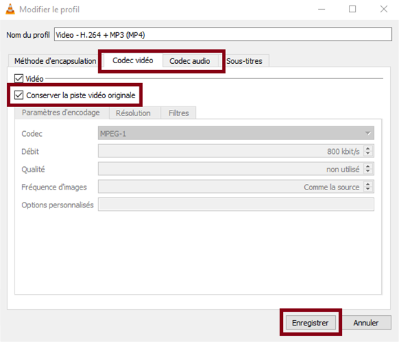

# Recouper une vidéo avec VLC
## Introduction

Il est possible d'utiliser VLC pour recouper une vidéo (avec le son), de manière à enlever le début et/ou la fin.  
Exemple : enlever les premières et dernières minutes d'un enregistrement d'une visioconférence.  

Avantages de la méthode ci-dessous :
- elle ne nécessite pas de réencoder la vidéo (opération qui peut être longue et entraîner une perte de qualité);
- il n'y besoin que du logiciel VLC (qui est en général déjà installé sur l'ordinateur).  

Cette méthode utilise la fonction "Convertir" du logiciel VLC.

## Prérequis
- Noter l’heure de début et l’heure de fin de la partie de la vidéo à conserver.  
  Par exemple :
	- Début : 00h 12min 32secondes
	- Fin : 01h 03min 14 secondes

## Etapes
1. Ouvrir VLC
2. Dans la barre de menu, cliquer sur « Média » puis sur « Convertir / Enregistrer … »
    (ou utiliser le raccourci clavier Ctrl-R)
    
    Une nouvelle fenêtre apparait :
    
    
3. Dans la rubrique « Sélection de fichier », ajouter la vidéo à recouper avec le bouton « Ajouter »  
4. Cocher la case « Afficher plus d’options »  
5. Indiquer la partie de la vidéo à conserver, en utilisant les champs « heure de début » et « heure de fin ». Il s’agit des heures notées précédemment (voir « Prérequis »)
6. Cliquer sur « Convertir / Enregistrer »
    
    Une nouvelle fenêtre apparait :
    
    
7. Vérifier que « Convertir » est coché
8. Cliquer sur l’icône en forme de clé à molette à côté du profil sélectionné
    
    Une nouvelle fenêtre apparait :
    
    
9. Cliquer sur l’onglet correspondant à chacun des codecs présents (« Codec vidéo », « Codec audio »), et à chaque fois, cocher la case « Conserver la piste vidéo originale ».
10. Cliquer ensuite sur Enregistrer.
    
    La fenêtre précédente apparait alors à nouveau :
    
11. Dans la section « Destination », cliquer sur « Parcourir », et indiquer la localisation et le nom du fichier de sortie.  
12. Enfin, cliquer sur « Démarrer » pour lancer la création du nouveau fichier (vidéo recoupée).  
